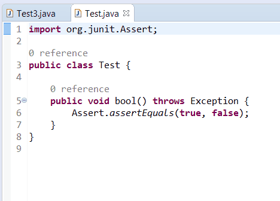
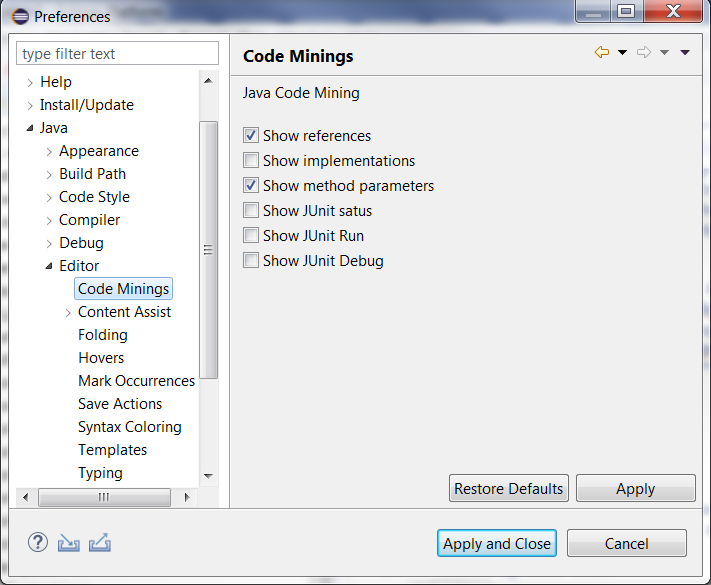
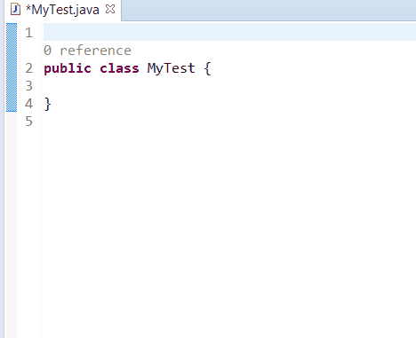
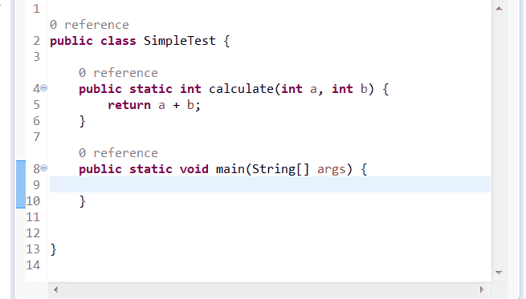

# jdt-codemining

Eclipse plugin for `JDT Java Code Mining` and `Git Code Mining` (Experimental)

JDT CodeMining is a an Eclipse plugin which requires `Eclipse Photon` based on JFace Text which provides [CodeMining support](https://www.eclipse.org/eclipse/news/4.8/M5/#Platform-Dev). 

## Requirements

`JDT Java CodeMining` requires `Eclipse Photon` (4.8) or above.

It is compatible with `Eclipse 2018-12` (4.10) in which [basic CodeMining features](https://www.eclipse.org/eclipse/news/4.10/jdt.php#jdt-codemining) are provided and enriched by `JDT Java CodeMining`.

# Install and activation

To install `JDT Java CodeMining`:

 * install last build of Eclipse Photon from https://www.eclipse.org/downloads/eclipse-packages/
 * install jdt-codemining with update site http://oss.opensagres.fr/jdt-codemining/snapshot/

By default minings are disabled, you must activate them with preferences:

## Show variable values inline while debugging

To show the result of the toString() method of an Object instead of for example `myObject= Integer  (id=20)` it is recommended to enable the following option:

Go to Preferences > Java > Debug > Detail Formatters. On the section `Show variable details ('toString()' value)` select `As the label for all variables`.

Before:

After:

# Features

## Java

jdt-codemining provides several JDT Java CodeMining:

 * `General`
   * `Show references`
   * `Show implementations`
   * `Show method parameter names`
   * `Show method parameter types`
   * `Show end statement`
 * `JUnit`   
   * `Show JUnit status`
   * `Show JUnit run`
   * `Show JUnit debug`
* `Debugging`
   * `Show variable values inline while debugging`

## EGit
 * Show revision recent change
 	* Show avatar
 	* Show date ago
 * Show authors

# Help us to get this into the Eclipse standard

Please `star this project if you want to have those CodeMinings inside JDT`. After discussing with JDT Team, this CodeMining support will not included for Photon release in June but perhaps in september if jdt-codemining receives good feedback. Indeed as CodeMining is a new feature which could cause some trouble (like performance) and JDT Team are very busy, they prefer not include my work on Java CodeMining for Photon release in June.  
 
So please star this github project and [create any issues](https://github.com/angelozerr/jdt-codemining/issues) to know your feelings and bugs. Thanks!

Issues can be about:

 * `performance`: indeed StyledText is not performant with big file and variable line height mode. As CodeMining can affect the line height (variable line height) to draw the mining before a line (like references), you could have trouble with performance. StyledText was improved to have better performance with variable line height, but it's not perfect yet. So please fill issues if you have troubles by describing your case (attach the big Java file, describes what you do, which version of Eclipse Photon you are using).
 * `regression`: StyledText was improved to have better performance in variable line height, please fill issue if you find regression (like scrollbar not well computed, focus problem after apply of completion, etc).
 * `new feature`: if you wish more settings to manage Java CodeMining, display other kind of mining, change the behaviour of mining when you click on it, etc, please create issues.

# Demos 
 
Here several demos with:

 * `References`:
  

 * `Method Parameter CodeMining`
 

 * `JUnit CodeMining`
 

